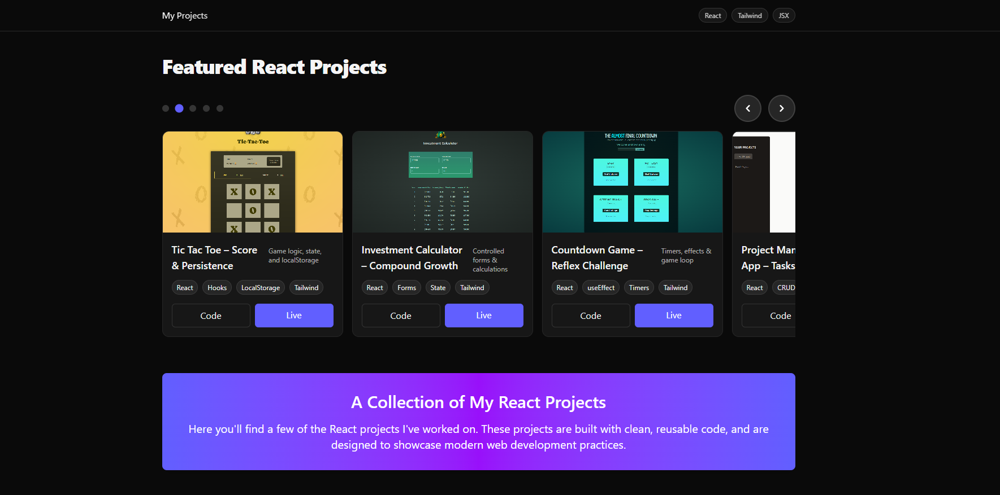

# 🚀 Carousel-React-Projects

This repository contains a simple **carousel gallery** built with **React** and **Tailwind CSS** that showcases my React projects. The carousel allows you to explore each of my projects by navigating through their details.

---

## 🌐 Live Demo

You can view the live demo of the carousel here:

- 🔗 **Live Project:** [Carousel-React-Projects - Live](https://projects-albadarin.netlify.app/)
- 💻 **Source Code:** [GitHub - Carousel-React-Projects](https://github.com/al-badarin/Carousel-React-Projects)

---

## 🛠 Technologies & Tools

-  Core logic & interactivity
-  Library for building UIs
-  Utility-first CSS framework
- ⚙️ Tools: Vite, ESLint, Prettier, Git, Netlify deployment

---

## 📌 Features

- **React-based carousel** to showcase projects dynamically.
- Responsive design built with **Tailwind CSS**.
- **Navigation controls** to go through projects with ease.
- **Live and source links** to view each project in action.
- Clean and simple design focusing on ease of navigation.

---

## 🖼️ Preview



---

## 📌 How to Use This Repo

1. Clone this repository using:

   ```bash
   git clone https://github.com/al-badarin/Carousel-React-Projects.git
   ```

2. Navigate to the project folder:

   ```bash
   cd Carousel-React-Projects
   ```

3. Install the necessary dependencies:

   ```bash
   npm install
   ```

4. Run the project locally:

   ```bash
   npm run dev
   ```

## 🌐 Explore My Projects

This carousel will guide you through my individual React projects. Each project is live on its own deployment, so you can interact with them directly. Below you can find the repo with the majority of my React Projects:

[React Projects](https://github.com/al-badarin/React-Projects)

---

## 🌐 Links

- 🔗 **Live Project:** [Carousel-React-Projects - Live](https://projects-albadarin.netlify.app/)
- 💻 **GitHub Repository:** [GitHub - Carousel-React-Projects](https://github.com/al-badarin/Carousel-React-Projects)
